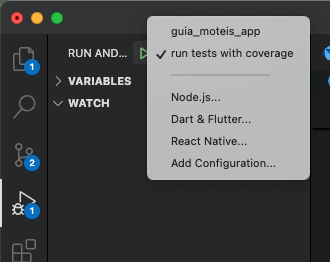
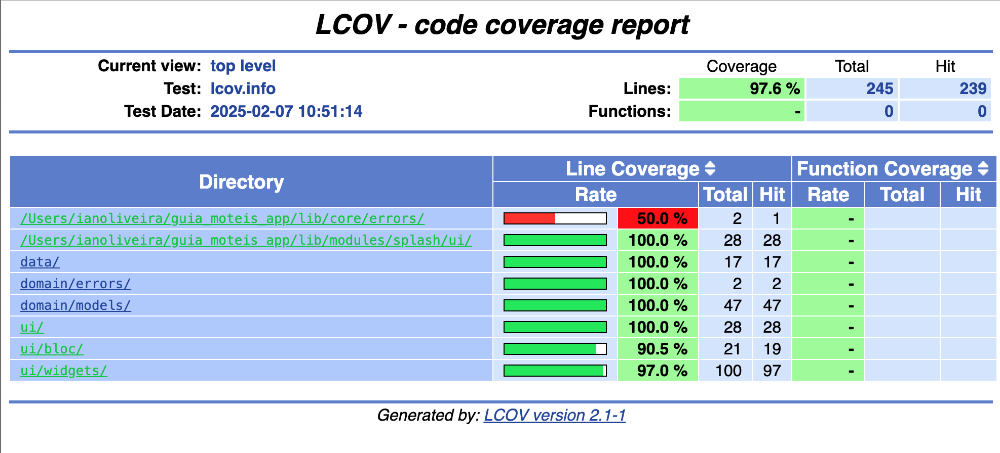

# Guia de Motéis - Teste para Desenvolvedor Mobile (Flutter)

Este repositório contém a implementação de uma tela de listagem de motéis, inspirada no aplicativo **Guia de Motéis GO**. O desafio foi realizado como parte do processo seletivo para a vaga de **Desenvolvedor Mobile (Flutter)**, com o objetivo de demonstrar habilidades no desenvolvimento de aplicativos utilizando o framework Flutter.

## Desafio

A tela implementada exibe uma lista de motéis, com informações como nome, preço e imagem, utilizando dados obtidos através de APIs mock fornecidas. O foco principal foi a construção de uma interface eficiente, bem como o consumo de APIs e o gerenciamento de estado de forma modularizada. Além disso, foram implementados testes unitários para garantir o correto funcionamento da aplicação.

## Funcionalidades

- **Listagem de Motéis**: Exibição de uma lista de motéis com nome, preço e imagem, consumindo dados das APIs fornecidas.
- **Testes Unitários**: Cobertura de testes unitários para garantir o correto funcionamento da listagem.
- **Gerenciamento de Estado**: Utilização o padrão Bloc para gerenciar o estado da aplicação.

## Tecnologias Utilizadas

- **Flutter**: Framework Flutter 3.27.3
- **Dart**: Linguagem Dart 3.6.1 
- **API Mock**: Dados obtidos dos seguintes links:
  - [API 1](https://api.npoint.io/e728bb91e0cd56cc0711)
- **Gerenciamento de Estado**: Biblioteca **[flutter_bloc](https://pub.dev/packages/flutter_bloc)** 
- **Testes Unitários**: Implementação de testes de unidade e widgets para garantir a qualidade do código.

## Screenshots do aplicativo rodando

<div style="display: flex;">
  
  
</div>

## Como Rodar o Projeto

1. Clone este repositório para a sua máquina local:
   ```bash
   git clone https://github.com/iang12/guia-moteis-app
   ```

2. Acesse o diretório do projeto:
   ```bash
   cd guia-moteis-app
   ```

3. Instale as dependências:
   ```bash
   flutter pub get
   ```

4. Rode o aplicativo:
   ```bash
   flutter run
   ```

5. Para rodar os testes unitários:
   ```bash
   flutter test --coverage
   ```
   Ou no Vs code clique na opção run tests with coverage.  Necessário o [Lcov](https://github.com/linux-test-project/lcov) instalado no pc.
   Veja a imagem abaixo:



## Cobertura de Testes

Abaixo está a cobertura de testes gerada para a aplicação com **97.6%**:




## Critérios de Avaliação

- **Código limpo e organizado**: A estrutura do código foi organizada de forma modular para facilitar a manutenção e a escalabilidade.
- **Uso correto do Flutter e boas práticas**: A aplicação segue as boas práticas recomendadas para o desenvolvimento com Flutter.
- **Gerenciamento de estado eficiente**: A aplicação utiliza o Bloc para garantir um gerenciamento de estado adequado.
- **Testes unitários**: Todos os principais componentes da aplicação são cobertos por testes unitários e Widgets.
- **Boa experiência do usuário**: A interface foi desenvolvida para proporcionar uma experiência agradável ao usuário.

